## Лаба с кодовым названием RUDN-QGIS-3D
Порядок создания **3D-модели** на *небольшой* участок местности со зданиями и внедренными 3D-моделями объектов в QGIS и Qgis2threejs


====================================================================================================================


### **Порядок создания 3D-модели на небольшой  участок местности со зданиями и внедренными 3D-моделями объектов в QGIS и Qgis2threejs**

#### **1) Подготовительная часть**

Создайте копию файла «Заготовка Проекта 3D.qgs», расположенного в корне папки «RUDN-QGIS-3D» с учебными материалами.

Переименуйте его, например, «**Проект 3D - Часть 2 - со зданиями.qgs**» и откройте этот проект в QGIS.

В панели Слои переместите слой «Здания - для второй части работы» на самый верх и включите его видимость.

Добавьте в проект вашу DEM (цифровую модель рельефа). Это файл с расширением **\*.tif**.

В панели Слои переместите слой с DEM в самый низ и отключите его видимость.

---------------------


| sdfdsf | fdgfdfd | ddddd   | ggggg   |
|--------|---------|---------|---------|
| 324    | 5435435 | 4435435 | 6757657 |


Ниже `начинается многострочный` блок кода

    <!doctype html>
    <html>
        <head>
            <!-- Заголовок документа -->
        </head>
        <body>
            <!-- Тело документа -->
        </body>
    </html>

Блок кода завершился

---------------------
- - - - - - - - -

$$\phi_{n}(\kappa) = \frac{1}{4\pi^{2}\kappa^{2}}\int_{0}^{\infty}\frac{\sin(\kappa R)}{\kappa R}\frac{\partial}{\partial R}\left\lbrack R^{2}\frac{\partial D_{n}(R)}{\partial R} \right\rbrack\, dR$$


********
* * * * *

Длинный блок кода  

```html

<br> &nbsp;&nbsp; 
    <p style="font-size: 16px; color: #0079c1; text-indent: 5px; margin-top: 5px;">
<b> &nbsp;&nbsp;&nbsp;&nbsp; 3D-геопортал окрестностей Махачкалы </b> </p>

```

---------------------
---------------------

**КАРТА**  
<script src="https://embed.github.com/view/geojson/benbalter/dc-wifi-social/master/bars.geojson?height=300&width=500"></script>
  
---------------------
---------------------
  
***Использование GeoJSON***  
Например, можно создать простую карту:  
```geojson
{
  "type": "FeatureCollection",
  "features": [
    {
      "type": "Feature",
      "id": 1,
      "properties": {
        "ID": 0
      },
      "geometry": {
        "type": "Polygon",
        "coordinates": [
          [
              [-90,35],
              [-90,30],
              [-85,30],
              [-85,35],
              [-90,35]
          ]
        ]
      }
    }
  ]
}
```

---------------------
---------------------
Блок ниже оформлен просто как "Цитирование текста":  

> ## Why write a program to do that?
> 
> Note that you can easily manually count the number of bacteria colonies shown
> in the morphometric example above. Why should we learn how to write a Python
> program to do a task we could easily perform with our own eyes? There are at
> least two reasons to learn how to perform tasks like these with Python and
> skimage:
> 
> 1. What if there are many more bacteria colonies in the Petri dish? For 
> 	example, suppose the image looked like this:

---------------------
---------------------


<!-- details - это тэг html. Без атрибута "open" по умолчанию свернуто -->

<details open><summary>CLICK ME - пример сворачиваемого/разворачиваемого раздела</summary>

### Так можно скрыть что угодно, даже код!
```ruby
   puts "Hello World"
```
и вообще, как понимаю, все, что угодно :)
</details>


---------------------
---------------------

<details><summary>CLICK ME - пример сворачиваемого/разворачиваемого раздела</summary>

<h2>Тесты А.В.Орловского</h2>
##Так можно скрыть что угодно, даже код!  
и вообще, как понимаю, все, что угодно :)

</details>

---------------------
---------------------


<!-- ===================================================================================================================== -->


<p style="letter-spacing: 4.5px">Lorem ipsum </p>
<p style="letter-spacing: -2pt; line-height:25pt"> Lorem ipsum dolor sit amet, consectetur adipiscing elit, sed do eiusmod tempor incididunt ut labore et dolore magna aliqua. </p>


<font color="#1f33b4ff">Синий текст</font>
<br>
<font face="Courier New" size="8" color="green"><b>Это мой текст!</b></font>


<h1>Моя подборка примеров блоков HTML-кода</h1>


<br>
<h2 style="font-size: 2.2em; font-family: monospace; color: #1a9835ff">Тесты А.В.Орловского</h2>


<h3>Это пример вставки ЗЩ в свою HTML-страницу с использованием iframe</h3>
<p>А это правильные рекомендации: You can use the height and width attributes to specify the size of the iframe:</p>
<iframe src="http://umap.openstreetmap.fr/ru/map/anonymous-edit/520224:cfEjyfnEYo7wlFFITRK3W5R8R4Y"  style="border:2px solid red; height:200px; width:100%; margin-left:100px;"
       >Почему-то текст здесь не на что не влияет, но и не виден???</iframe>

<br>
<br>
<br>
<h3>Это пример вставки гиперссылки, как картинки и логически связанной с ней подписью:</h3>
<!-- Нашел его здесь https://netology-code.github.io/guides/wm-cheat-sheet -->


<br>
<h3>Это пример использования аббревиатур:</h3>
<!-- Нашел его здесь https://webref.ru/course/html-content/inline-semantics -->
<p>
  Я только что купил <abbr title="Compact Disc">CD</abbr>.
</p>


<br>
<h3>Это пример строчной цитаты (кавычки):</h3>
<!-- Нашел его здесь https://webref.ru/course/html-content/inline-semantics -->
<!-- <blockquote> является блочным элементом, у него есть строчная версия <q> -->
<p>
  Он сказал <q>Привет, мир</q> и просто ушёл.
</p>


<br><br><br>
<p>ххххххххххххххх Это как бы нижний элемент у меня на странице ххххххххххххххх</p>
<br><br><br>


<div class="footer">
        &copy; 2004 Foo Corporation
</div>


* элемент маркированного списка
- ещё один элемент ненумерованного списка
+ буллеты элементов могут быть разными

1. Элемент нумерованного списка
2. Элемент №2 того же списка
9. Элемент №3 списка — элементы нумеруются по порядку, цифра в начале строки не имеет значения


Добавьте в интерфейс QGIS «**Панель координат**», включив ее через основное меню:  
«Вид Панели инструментов Панель координат».  
*(в версиях QGIS новее 3.16 эта панель называется «Дополнительные инструменты оцифровки»).*

**2) Установка дополнительных модулей, необходимых для работы**
  
  
  
  
Установите в QGIS следующие модули:

 **Memory Layer Saver**

Модуль позволяет <font color="#1f33b4ff"><b>сделать имеющиеся</b></font> в проекте временные векторные слои постоянными, сохраняя их в отдельный файл с расширением \*.mldata и именем, как у самого проекта.  
*Файл с сохраненными временными слоями создается в момент сохранения проекта в том же месте,*
*где расположен файл проекта.*  
Никаких кнопок или меню в интерфейс QGIS модуль не добавляет.
<https://plugins.qgis.org/plugins/MemoryLayerSaver>


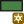 **Geometry Shapes**

Плагин позволяет рисовать основные геометрические фигуры в том числе с заданными пользователем размерами.

Возможные варианты: прямоугольники, квадраты, овалы и круги.

*Используйте клавишу «Shift», чтобы создавать идеальные квадраты и круги.*

Интегрируется как дополнительная кнопка в панель «Инструменты оцифровки».

Подробности смотрите по ссылкам:

<https://plugins.qgis.org/plugins/GeometryShapes>

<https://github.com/pvandegeer/GeometryShapes>

 **QuickOSM**

Позволяет загружать в QGIS данные OSM, выполняя пользовательские запросы к Overpass.

*Специальный синтаксический анализатор позволяет увидеть все доступные ключи OSM в QGIS.*

*Вы также можете открывать локальные файлы OSM или PBF.*

Подробности смотрите по ссылкам:

<https://plugins.qgis.org/plugins/QuickOSM>

[**https://docs.qgis.org/3.16/ru/docs/training_manual/qgis_plugins/plugin_examples.html\#basic-fa-the-quickosm-plugin**](https://docs.qgis.org/3.16/ru/docs/training_manual/qgis_plugins/plugin_examples.html#basic-fa-the-quickosm-plugin)

<https://docs.3liz.org/QuickOSM>

<https://github.com/3liz/QuickOSM>

**3) Выбор для создаваемой 3D-модели участка с эффектными зданиями**

С помощью слоя «Здания - для второй части работы» в пределах границ вашей DEM найдите наиболее крупный населенный пункт и выберите в нем территорию, на которой будут присутствовать наиболее эффектные в архитектурном плане здания, для которых имеется информация об их высоте.

**Справочно:**

*В слое «Здания - для второй части работы» представлена информация обо всех имеющихся (оцифрованных на данный момент) в OpenStreetMap (OSM) зданиях.*

*Здания отображаются на карте при масштабе* **1:34 123** *и крупнее серой заливкой с черной обводкой. А при увеличении масштаба карты до* **1:17 061** *и крупнее, здания, высота которых по внесенной в OSM информации превышает 5 метров ( \> 5 m ), начнут отображаться красным цветом с указанием (подписью на здании) значения высоты в метрах.*

*Здания для которых указана высота менее 5 метров включительно ( =\< 5 m ) или для которых информация о высоте отсутствует, будут по-прежнему отображаться серой заливкой с черной обводкой.*

Для удобства и наглядности, при окончательном выборе необходимого участка задайте

в основном окне QGIS значение масштаба для карты равное **1:15 000**.

Для этого в строке состояния *(расположена в самом низу окна QGIS)* в пункте «Масштаб» введите в самом окошке, отображающем значения масштаба, «**15000**» и выйдите из окошка.

**4) Создание ГИС-слоя границ создаваемой 3D-модели**

Откройте меню «Слой Создать слой Новый временный слой».

В появившемся меню задайте **Имя слоя** (например «Границы 3D-модели»),

а для параметра «**Тип геометрии**» выберите из ниспадающего меню значение «**Полигон**».

Остальные параметры оставьте без изменений.

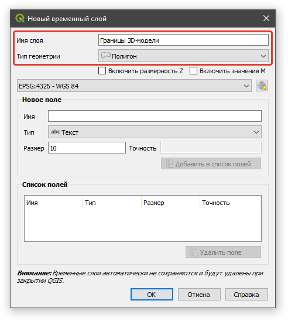

Задав необходимые опции, нажмите кнопку «**ОК**».

Выберите в панели «Инструменты оцифровки» кнопку 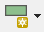(Draw rectangle geometry).

Удерживая нажатой клавишу «Shift» нарисуйте на карте квадрат желаемого размера и, после появления меню «Set size (метры)»

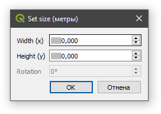

уточните размеры квадрата, задав его желаемые размеры в метрах, и нажмите кнопку «**ОК**».

Для удобства и наглядности, измените стиль содержащего квадрат слоя на «**Без заливки**».

Выберите в панели инструментов «Панель координат» кнопку 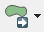(Переместить объекты).

Переместите с помощью это инструмента созданный вами квадрат в наиболее удачное по вашему мнению место (позицию/локацию).

Сохраните изменения в слое с границами создаваемой 3D-модели и выйдите из режима его правки через контекстное меню к слою.

Сохраните и сам QGIS-проект.

**5) Загрузка в QGIS-проект векторного слоя зданий из OpenStreetMap**

Откройте панель «**Инструменты анализа**» через меню «**Анализ данных**» «**Панель инструментов**»

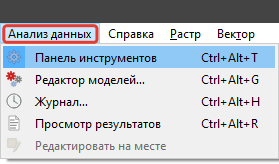

или воспользуйтесь кнопкой 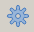, или нажмите комбинацию клавиш «Ctrl + Alt + T».

Введите в окне поиска алгоритмов «**OSM**»

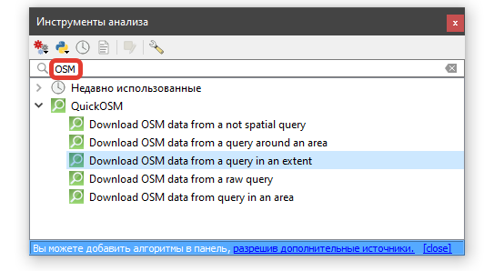

и откройте алгоритм «**Download OSM data from a query in an extent**», сделав двойной щелчок мышью на его названии.

В открывшемся окне алгоритма для опции **«Ключ по умолчанию для всех ключей [необязательно]»** задайте значение «**building**».

Для опции «Покрытие» нажмите соответствующую кнопку с многоточием, выберите из появившегося списка вариант «**Рассчитать из слоя**», а затем выберите созданный вами слой границ для 3D-модели. После этого в окошке опции «Покрытие» появятся значения соответствующих координат.

Для сохранения результата (векторного слоя со зданиями) на компьютере, нажмите кнопку  
с многоточием и выберите из появившегося списка вариант «**Сохранить в файл …**».

Данные будут сохраняться в ГИС-формате **\*.gpkg** (GeoPackage).

Задайте имя для целевого файла как, например, «Здания».

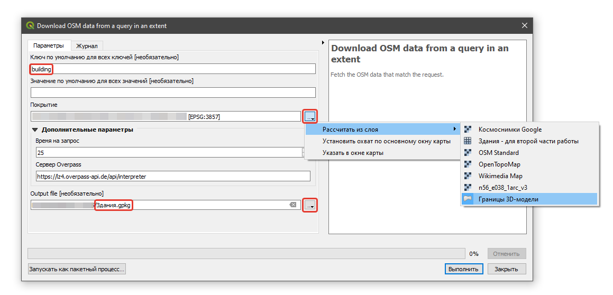

Задав необходимые опции, нажмите кнопку «**ОК**» и дождитесь появления нового слоя (загруженного из OSM слоя зданий) в панели «Слои».

Нужный для работы полигональный слой будет иметь название «**Здания_multipolygons**».

Возможно, что в QGIS-проект загрузятся дополнительные слои:

\- точечный слой «Здания_points» и

\- линейный слой «Здания_lines».

Они вам **не потребуются**. **Удалите их** из QGIS-проекта.

Переименуйте слой «Здания_multipolygons» на «Здания» и

переместите его в панели «Слои» на самый верх.

Обязательно сохраните сам QGIS-проект.

С большой вероятностью может оказаться, что контуры некоторых зданий будут выходить  
за пределы границ, определенных вами для создаваемой 3D-модели.

*Например:*


Такие здания *(их 3D-геометрии)* на финальной 3D-модели будут либо выходить за пределы вашей 3D-модели, как бы «торча» из общей модели и повисая в пространстве.


<p style="text-align: center;"></p>


Либо (если включена опция «Clip geometries») окажутся «вертикально разрезанными»  
по линии границы вашей 3D-модели и будут выглядеть не вполне естественно для зданий. При этом такие «разрезы» зданий будут находиться на самой границе 3D-модели, придавая ей несколько неопрятный (неэстетичный) вид.

<center>

</center>

Поэтому удалите такие «лишние» здания из вашего слоя «Здания».

К таким «лишним» зданиям целесообразно отнести не только те, которые пересекают границу вашей 3D-модели, но и те, которые находятся слишком близко к ее краю.

Для этого выделите в панели «Слои» слой «Здания».

Активизируйте инструмент 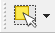 (Выбрать объекты в прямоугольнике или точке).

С его помощью выделите все здания, которые вы посчитаете целесообразным удалить.

*Выделенные объекты окрашиваются в желтый цвет.*

*Использование клавиш «Shift» и «Ctrl» позволит сделать процесс выделения более гибким, позволяя добавлять/исключать объекты к/из текущей выборки.*

*За дополнительной информацией о способах выделения объектов на карте вручную обратитесь к соответствующему разделу Документации QGIS по* [*ссылке*](https://docs.qgis.org/3.16/ru/docs/user_manual/introduction/general_tools.html?#selecting-manually-on-the-map-canvas)*.*

*Обратите особое внимание на возможность использования клавиши «Alt», позволяющей выбирать объекты, которые будут полностью находиться в пределах фигуры выделения.*

Вернуть случайно сброшенное выделение можно через меню:

«Правка Выделить Вернуть выделение».

В случае необходимости снять все сделанные выделения можно нажав кнопку 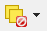.

После того, как вы выделите все здания, которые хотите удалить, откройте в панели «Слои» контекстное меню к слою «Здания» и активируйте для него «Режим правки».

Для удаления из слоя выделенных вами зданий, нажмите кнопку  в интерфейсе QGIS

или клавишу «Delete» на клавиатуре.

Деактивируйте «Режим правки» слоя «Здания», сохранив внесенные в него изменения.

**6) Создание 3D-модели самого ландшафта (без зданий)**

В панели «Слои» откройте контекстное меню к слою «Границы 3D-модели» и выполните действие «Увеличить до слоя».

Отключите видимость всех слоев, кроме слоя «**Космоснимки Google**».

Запустите модуль Qgis2threejs, нажав кнопку 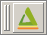 в панели инструментов интерфейса QGIS.

В открывшемся окне «**Qgis2threejs Exporter**» в панели «**Layers**» включите (активируйте) слой вашей цифровой модели рельефа (DEM) (в моем примере это «n56_e038_1arc_v3»):

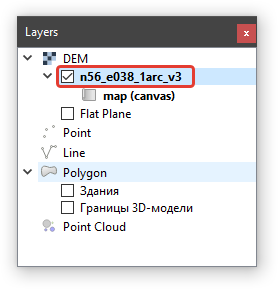

В «Qgis2threejs Exporter» щелкните правой клавишей мыши по имени слоя вашей DEM и выберите в открывшемся контекстном меню пункт «**Properties...**».

На закладке «**Main**» появившегося окна задайте (выставьте) следующие опции:

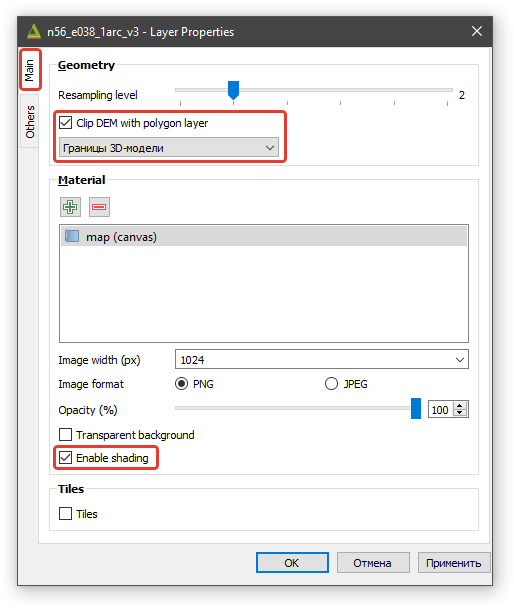

Перейдите на закладку «**Others**» и задайте (выставьте) следующие опции:

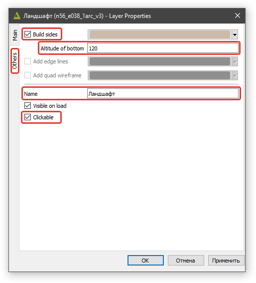

Самостоятельно подберите такое значение для опции «Altitude of bottom» (оно определяет высоту боковых сторон 3D-модели), чтобы модель выглядела изящно и эстетично.

Задав необходимые опции, нажмите последовательно клавиши «**Применить**» и «**ОК**».

Откройте в «Qgis2threejs Exporter» меню «**Scene** **Scene Settings...**» и в появившемся окне задайте (введите) следующие опции:

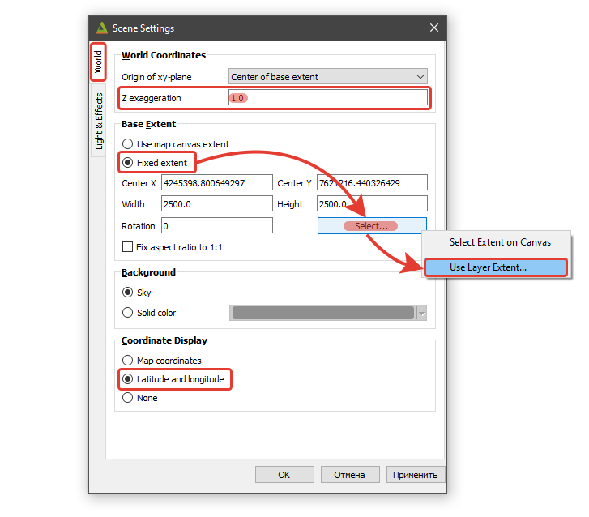

Оставьте значение для опции «**Z exaggeration**» (преувеличение) равным «**1.0**».

В блоке «**Base Extent**» выберите опцию/метод «**Fixed extent**», нажмите кнопку «**Select…**» и выберите вариант «**Use Layer Extent…**» (использовать охват слоя).

В появившемся окошке выберите из ниспадающего меню «**Границы 3D-модели**»:

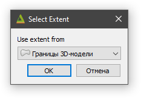

Задав указанные опции, нажмите последовательно клавиши «**ОК**».

**7) Добавление в 3D-модель зданий и настройка их отображения**

В окне «Qgis2threejs Exporter» в панели «Layers» включите (активируйте) слой «**Здания**»:

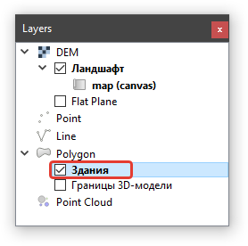

В «Qgis2threejs Exporter» щелкните правой клавишей мыши по имени слоя «Здания»

и выберите в открывшемся контекстном меню пункт «**Properties...**».

На закладке «**Main**» появившегося окна задайте (выставьте) следующие опции:

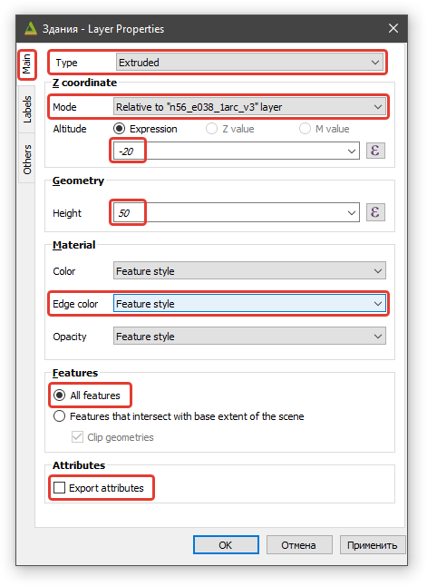

Задав указанные опции, нажмите клавишу «**ОК**».

В результате вы получите 3D-модель с объемными зданиями, возвышающимися над рельефом на одинаковую высоту в 30 м *(Вертикальная сторона 3D-объектов зданий задана в 50 м. При этом, для исключения эффекта висящих над земной поверхностью углов зданий, основания зданий опущены на 20 м ниже земной поверхности)*.

Сделайте 3D-модель более реалистичной, используя имеющуюся для некоторых зданий в таблице атрибутов слоя информацию об их этажности.

*Информация о количестве этажей зданий хранится в поле «***building:levels***» таблицы атрибутов загруженного из OSM слоя контуров зданий.*

Для этого для опции «**Height**» в блоке «**Geometry**» вместо фиксированного значения «50» скопируйте и вставьте следующее выражение:

CASE

WHEN "building:levels" IS NULL THEN ( 30 + 20 )

ELSE "building:levels" \* 4 + 20

END

Сделать для зданий без высоты некоторое варьирование с помощью «randf»

WHEN "building:levels" IS NULL THEN ( 30 \* rand(90, 110)/100 + 20 )

В этом выражении высота одного этажа принята равной 4 м.

Для зданий информация о количестве этажей которых в таблице атрибутов отсутствует,

величина их возвышения на земной поверхностью определено в 30 м.

|  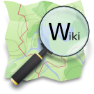 **Описание на Wiki OSM** Интересные подробности о том, как OpenStreetMap представляется информация о зданиях, а также о числе этажей здания, расположенных над поверхностью земли, смотрите по ссылкам ниже: **RU:Key:building:**  <https://wiki.openstreetmap.org/wiki/RU:Key:building?uselang=ru> **RU:Key:building:levels** <https://wiki.openstreetmap.org/wiki/RU:Key:building:levels?uselang=ru>  |
|----------------------------------------------------------------------------------------------------------------------------------------------------------------------------------------------------------------------------------------------------------------------------------------------------------------------------------------------------------------------------------------------------------------------------------------------------------|

Измените цвет зданий на карте в основном окне QGIS, выполнив классификацию для слоя «Здания» по какому-либо логичному для данного случая полю значений, представленному в таблице атрибутов слоя.

Поля в таблице атрибутов слоя «Здания» имеют тип «String» (Текст).

Поэтому для классификации воспользуйтесь методом стилизации «Уникальные значения».

Откройте панель настройки стиля и измените метод стилизации с «Обычный знак» на «Уникальные значения». Для опции «Значение» выберите подходящее поле, например,

«**building:levels**» и какой-либо двух- и более цветный градиент для опции «Цветовой ряд».

Затем нажмите кнопку «Классифицировать».

Теперь выполните классификацию зданий по их этажности из самого модуля Qgis2threejs.

Для этого для зданий в опции «**Color**» в блоке «**Material**» вместо варианта «Feature style» выберите из ниспадающего списка «**Expression**», а в появившееся ниже окошко скопируйте и вставьте следующее выражение:

**CASE**

**WHEN** "building:levels" **\>** 5 **THEN** color_rgb**(**0**,** 255**,** 0**)** -- высокие

**WHEN** "building:levels" **\<=** 5 **THEN** color_rgb**(**0**,** 0**,** 255**)** -- низкие

**ELSE** color_rgb**(**255**,** 0**,** 0**)** -- информация о количестве этажей отсутствует

**END**

Измените представленные в выражении значения на более подходящие для создаваемой вами 3D-модели (учитывая, в том числе, особенности выбранного вами участка местности).

==============================================

Добавьте деревья

Добавьте стрелку Севера

Добавьте колонтитулы

Создайте анимацию

Увеличьте точность DEM и разрешение

Экспортирование 3D-модели в html-веб-страницу

**Опубликуйте созданную вами 3D-модель в Интернет**


**Экспортируйте вашу 3D-модель в обменный формат glTF**


    
    
====================================================================================================================


